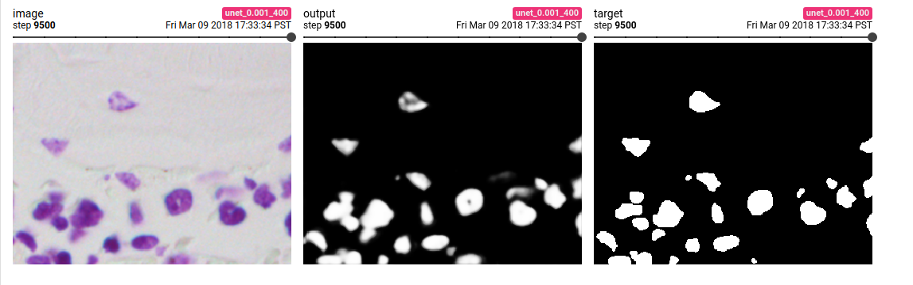
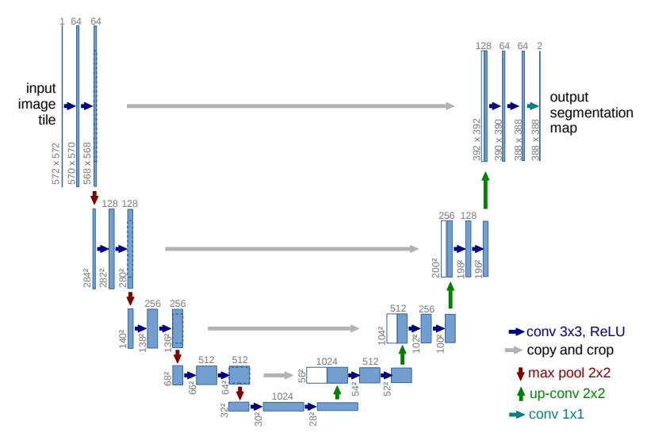
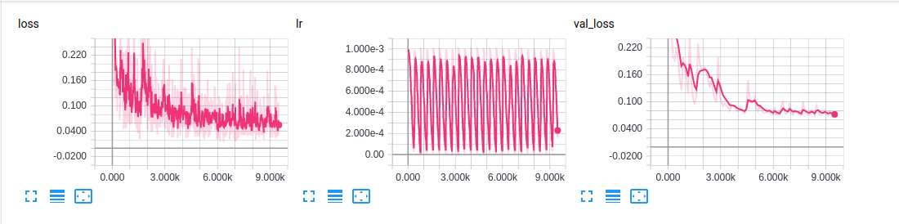

# 2018 Data Science Bowl
https://www.kaggle.com/c/data-science-bowl-2018

Find the nuclei in divergent images to advance medical discovery


## Contents
- Image, Mask joint transforms for segmentation augmentations.
- Unet: https://arxiv.org/pdf/1505.04597.pdf


- Stochastic Gradient Descent with Warm restarts: https://arxiv.org/abs/1608.03983



# Status
- Simple Unet solution, testing pipeline.

## Setup

1. install pytorch and torchvision:
```
conda install pytorch -c pytorch
```

2. install other requirements:
```
pip install -r requirements.txt
```
## Usage
1. create train and validation directories
```
python create_train_val.py
```
2. train Unet
```
python train.py
```
3. view logs in Tensorboard
```
tensorboard --logdir runs
```


